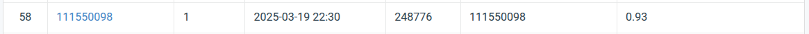

# DLCV 2025 HW1

name: 楊宗儒
id: 111550098

## Introduction

In this homework, we are going to train a ResNet-based model to perform an image classification task consisting of 100 classes. The entire dataset has about 25,000 images of plants and animals etc. 
The main idea of our approach is to leverage the pretrained weights on ImageNet datasets, and to use an improved version of ResNet (ResNext) as our backbone.

## How to install

### Dataset
```
gdown 1fx4Z6xl5b6r4UFkBrn5l0oPEIagZxQ5u
tar -xzf hw1-data.tar.gz data
```

### Run Container

```
docker build -t dlcv-hw1 .
docker run --shm-size=8g --detach --rm -it --init --gpus=all -v $(pwd):/app --name dlcv-hw dlcv-hw1
docker attach dlcv-hw
```

If you want to use wandb, add the wandb api key as following: 
```
docker run --shm-size=8g --detach --rm -it --init --gpus=all -v $(pwd):/app --name dlcv-hw -e WANDB_API_KEY=<your api key> dlcv-hw1
```

### Train

After attach to the container: 
```
python3 main.py
```

the model would be at /app/checkpoint/

### Inference

```
python3 inference.py --model checkpoint/<model name>.ckpt
```

The output is in prediction.csv

### Train with contrastive loss
```
python3 main_contrast.py
```


## Performance Snapshot

